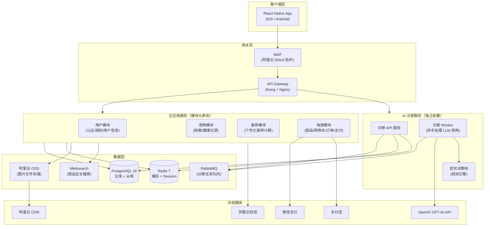
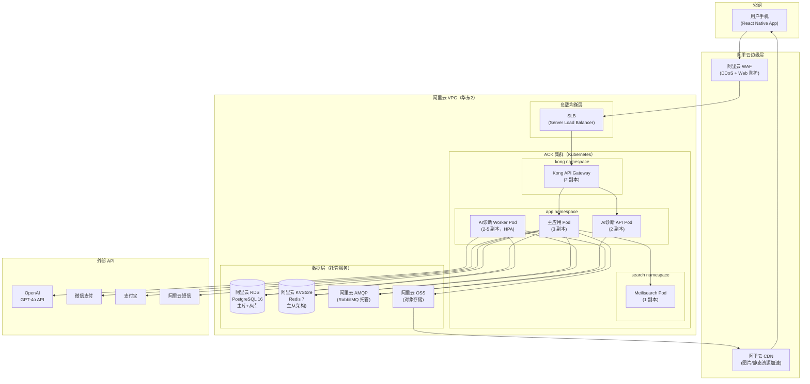

# 宠物AI一体化 App — 技术架构设计文档

> **版本**：v1.0.0
> **架构师**：Architect Agent
> **创建日期**：2026-03-31
> **最后更新**：2026-03-31
> **状态**：草稿
> **关联 PRD**：prd-pet-ai.md v1.0.0

---

## 0. 文档索引

| 文档 | 路径 | 说明 | 模式 |
| ---- | ---- | ---- | ---- |
| **主架构文档（本文档）** | `architecture-pet-ai.md` | 系统整体架构、技术栈选型、部署方案、非功能需求 | 单文档模式 |

> 本文档采用**单文档模式**，所有章节内容完整写入此文件。

---

## 1. 设计概述

### 1.1 项目背景

中国宠物市场 2024 年规模超过 3400 亿元，宠物保健品/处方粮增速超过 700%，但市场上尚无头部产品将「AI 辅助健康初诊」与「电商购物」打通闭环。本产品旨在打造集「AI 症状初诊 + 个性化保健品推荐 + 宠物用品电商」于一体的移动 App，以 AI 驱动的健康建议为核心差异化，实现「诊断即推荐，推荐即购买」的闭环体验。

系统面向主要用户群体为 25–35 岁都市宠物主（iOS/Android 移动端），预计上线 6 个月 MAU 达 10 万，12 个月月 GMV 突破 500 万元。

### 1.2 设计目标

| 目标 | 描述 | 衡量标准 |
| ---- | ---- | -------- |
| 核心闭环可用 | AI 初诊 → 推荐 → 购买完整链路在 MVP 交付 | P0 功能 100% 覆盖 |
| 高性能响应 | AI 诊断 ≤10s，API ≤500ms，首屏 ≤2s | 性能测试达标 |
| 高可用 | 系统 SLA ≥99.5%，AI 服务不可用时平滑降级 | 监控告警覆盖所有核心链路 |
| 安全合规 | 用户数据满足《个人信息保护法》，AI 输出合规 | 安全审计通过 |
| 可扩展 | 支持峰值 500 QPS，架构支持横向扩展至 5000 QPS | 压测验证 |

### 1.3 设计原则

- **简单优先**：MVP 阶段选择最简方案，避免过度设计；单体优先，按需拆分
- **业务闭环驱动**：每个技术决策围绕「AI初诊→推荐→电商」核心转化链路优化
- **AI 成本可控**：通过缓存、降级策略控制 LLM API 调用成本，避免成本失控
- **移动端优先**：架构和接口设计以 React Native 移动端为第一交付目标
- **合规内建**：安全和隐私合规从架构层面保障，而非事后补丁

### 1.4 范围与边界

| 范围 | 包含 | 不包含 |
| ---- | ---- | ------ |
| 移动端 App | iOS / Android（React Native） | Web 端、小程序 |
| 后端服务 | 用户/宠物/AI诊断/推荐/电商 5 个业务服务 | 线下门店系统、BI 数据仓库 |
| AI 能力 | OpenAI GPT-4o API + 症状决策树 | 自训练模型、图像识别（P2 后续） |
| 电商 | 商品浏览/购物车/支付/订单 | 售后客服系统、仓储物流管理 |
| 支付 | 微信支付 + 支付宝 | 信用卡、境外支付 |

### 1.5 需求追溯矩阵

| PRD 需求编号 | 需求描述 | 优先级 | 对应架构模块 | 对应 API | 备注 |
| ------------- | -------- | ------ | ------------ | ------- | ---- |
| US-001 | AI 症状问答，10 秒内返回健康评估 | P0 | AI 诊断服务 | `POST /api/v1/diagnosis` | 含三级评估分级 |
| US-002 | AI 初诊后自动展示推荐保健品 | P0 | 推荐服务 | `GET /api/v1/recommendations?diagnosis_id=` | 关联初诊结果 |
| US-003 | 创建宠物健康档案，支持多宠物 | P0 | 宠物服务 | `POST /api/v1/pets` | 影响 AI 推荐精度 |
| US-004 | 查看历史诊断记录（12 个月） | P1 | AI 诊断服务 | `GET /api/v1/diagnosis/history` | 需软删除设计 |
| US-005 | App 内完成支付（微信/支付宝） | P0 | 电商服务 | `POST /api/v1/orders` | 集成支付网关 |
| US-006 | AI 回答使用易懂语言，附科普说明 | P1 | AI 诊断服务 | `POST /api/v1/diagnosis` | Prompt 工程优化 |
| US-007 | 按品种/年龄筛选保健品 | P1 | 推荐服务 | `GET /api/v1/recommendations` | 支持 query 参数 |
| US-008 | 多宠物快速切换问诊 | P1 | 宠物服务 + AI 诊断服务 | `GET /api/v1/pets` + 初诊接口 | 前端状态管理 |
| F-AUTH-001 | 手机号 + 验证码注册/登录 | P0 | 用户服务 | `POST /api/v1/auth/login` | 防刷限流 |
| F-EC-001 | 商品搜索与浏览 | P0 | 电商服务 | `GET /api/v1/products` | 全文检索支持 |
| F-EC-002 | 购物车与结算 | P0 | 电商服务 | `POST /api/v1/cart`, `POST /api/v1/orders` | 库存锁定 |
| F-EC-003 | 订单管理与物流查询 | P0 | 电商服务 | `GET /api/v1/orders` | 物流 API 接入 |

---

## 2. 技术栈选型

### 2.1 选型总览

| 层级 | 技术选型 | 选型理由 | 备选方案 |
| ---- | -------- | -------- | -------- |
| **移动端框架** | React Native 0.74 | PRD 已明确指定；跨平台覆盖 iOS/Android，降低维护成本；生态成熟 | Flutter（性能更好但学习曲线陡） |
| **后端框架** | Node.js 20 LTS + TypeScript + Fastify | PRD 已明确；Fastify 比 Express 性能高 2-3 倍；TypeScript 强类型减少线上 Bug | NestJS（功能更全但启动慢） |
| **API 网关** | Nginx + Kong | 成熟稳定；支持限流、认证、路由转发；阿里云 ACK 原生集成 | Traefik（Kubernetes 原生更优但运维成本高） |
| **主数据库** | PostgreSQL 16 | 关系型数据（用户/订单/宠物档案）天然适合；支持 JSON 字段存储半结构化数据；阿里云 RDS 托管降低运维成本 | MySQL（PostgreSQL JSON 支持和扩展能力更强） |
| **缓存** | Redis 7 | PRD 已明确；热点商品数据缓存；AI 问答结果缓存；Session 存储；支持分布式锁 | Memcached（功能单一不满足需求） |
| **消息队列** | RabbitMQ | AI 诊断任务异步处理，解耦请求与 LLM 调用延迟；支持任务重试；阿里云 AMQP 托管版 | Kafka（吞吐量过剩，运维复杂度高） |
| **搜索引擎** | Meilisearch | 商品全文搜索；开源、轻量（vs Elasticsearch 资源占用低 80%）；中文分词友好；适合 MVP 阶段 | Elasticsearch（企业级但资源消耗大） |
| **对象存储** | 阿里云 OSS + CDN | PRD 已明确；宠物图片和商品图片存储；CDN 节点覆盖全国；与阿里云 ECS/ACK 同区域内网访问 | 腾讯云 COS（功能相当，因部署在阿里云优先 OSS） |
| **AI/ML** | OpenAI GPT-4o API + 症状决策树 | PRD 已明确；MVP 阶段避免自训练模型成本；LLM + 规则混合保证关键场景准确性 | Azure OpenAI（可作为备用节点） |
| **短信服务** | 阿里云短信 | 手机验证码发送；阿里云生态内可靠性高；合规备案资质齐全 | 腾讯云短信 |
| **CI/CD** | GitHub Actions | 与代码仓库天然集成；免费 runner 可满足 MVP 阶段；多环境部署 workflow 支持好 | GitLab CI（需自建运维） |
| **容器编排** | 阿里云 ACK（Kubernetes） | PRD 已明确 K8s；阿里云托管版降低运维成本；支持 HPA 弹性伸缩 | 自建 K8s（运维复杂度不可控） |
| **监控** | Prometheus + Grafana | 开源标准；Kubernetes 原生集成；自定义业务指标灵活 | 阿里云 ARMS（商业版成本高） |
| **日志** | ELK Stack（Elasticsearch + Logstash + Kibana） | 结构化日志查询和告警；K8s 日志采集成熟 | 阿里云日志服务 SLS（可作为替代） |

### 2.2 关键选型决策记录（ADR）

#### ADR-1：后端架构风格选择

- **状态**：接受
- **背景**：PRD 中 5 个业务域（用户/宠物/AI诊断/推荐/电商）职责明确，且 AI 诊断涉及异步长耗时调用（≤10s），需要与同步 API 隔离
- **候选方案**：纯单体 vs 微服务 vs 模块化单体（Modular Monolith）
- **评估维度**：开发速度 / 部署复杂度 / 扩展性 / 团队规模（MVP 阶段 5-8 人）
- **结论**：选择**模块化单体 + AI 诊断服务独立部署**的混合架构
- **理由**：MVP 阶段团队小，纯微服务网络开销和运维成本不可接受；但 AI 诊断的异步特性和独立扩容需求要求独立部署；其余 4 个服务作为模块化单体，共享数据库，按需后期拆分
- **后果**：上线后若某服务流量激增（如电商大促），可独立拆出；技术债：模块间边界需严格通过接口隔离

#### ADR-2：AI 诊断方案

- **状态**：接受
- **背景**：AI 诊断是核心差异化功能，准确性和延迟均有严格要求（≤10s），且有合规约束（不能定性为"医疗诊断"）
- **候选方案**：纯 LLM（GPT-4o）vs 纯规则决策树 vs LLM + 决策树混合
- **评估维度**：准确性 / 延迟 / 成本 / 合规安全
- **结论**：LLM + 症状决策树混合方案
- **理由**：决策树处理高频常见症状（如"不吃饭"→需问脱水/精神状态），降低 LLM 调用频次控制成本；LLM 处理复杂症状描述，提升用户体验；两者结合同时满足准确性和成本控制
- **后果**：需维护症状决策树知识库；初期可先上纯 LLM 方案，再迭代加入决策树

#### ADR-3：移动端框架选择

- **状态**：接受（PRD 已指定）
- **背景**：需同时支持 iOS 14+ 和 Android 9+，屏幕适配范围 375px-428px
- **候选方案**：React Native vs Flutter vs 原生双端
- **评估维度**：开发效率 / 性能 / 生态 / 团队经验
- **结论**：React Native
- **理由**：PRD 已明确指定；与后端 TypeScript 技术栈一致，可复用类型定义；社区成熟，宠物 App 不涉及极端性能场景
- **后果**：部分原生模块（如支付 SDK、推送）需额外封装；JSI 架构已大幅缩小与 Flutter 的性能差距

---

## 3. 系统架构

### 3.1 架构风格

**选择**：模块化单体（Modular Monolith）+ AI 诊断服务独立部署（混合架构）

**理由**：MVP 阶段团队规模约 5-8 人，纯微服务的服务间通信、分布式事务、独立运维成本与团队规模不匹配。采用模块化单体将业务域严格隔离为模块，共享数据库但通过接口边界防止耦合。AI 诊断服务因异步特性和独立扩容需求单独部署，是唯一的真正微服务。

### 3.2 整体架构图



### 3.3 模块职责

| 模块/服务 | 职责 | 核心功能 | 依赖 |
| --------- | ---- | -------- | ---- |
| 用户模块 | 用户身份认证和信息管理 | 手机号+验证码注册/登录、JWT 签发、用户资料管理、三方登录（P2） | Redis（Session/Token黑名单）、阿里云短信 |
| 宠物模块 | 宠物档案全生命周期管理 | 宠物档案 CRUD、健康记录、体重趋势、疫苗/就诊记录 | PostgreSQL、OSS（宠物头像） |
| 推荐模块 | 个性化保健品推荐计算 | 基于初诊结果+宠物档案计算推荐商品列表、品种/年龄筛选 | PostgreSQL、Redis（推荐缓存） |
| 电商模块 | 完整电商交易链路 | 商品目录、全文搜索、购物车、订单创建、支付网关对接、订单状态流转 | PostgreSQL、Redis（购物车/库存锁）、Meilisearch、微信支付/支付宝、OSS（商品图） |
| AI 诊断服务（独立） | AI 健康初诊核心能力 | 接收症状请求→决策树预处理→LLM 调用→结果解析→健康评估分级 | OpenAI API、RabbitMQ、Redis（诊断结果缓存）、PostgreSQL（诊断记录持久化） |

### 3.4 前端架构（基于原型图分析）

#### 原型图分析摘要

| 分析项 | 结果 |
| ------ | ---- |
| 原型图来源 | wireframes（低保真，共 8 个页面） |
| 页面总数 | 8 个（含导航首页） |
| 前端复杂度评级 | 中 |
| 核心交互模式 | 表单提交（问诊/档案/登录）、列表展示（推荐商品/订单）、状态轮询（AI诊断结果）、多 Tab 切换（宠物档案）、购物车增删改 |
| 状态管理方案 | Redux Toolkit + React Query |

**页面清单与路由设计**：

| 页面 | 路由 | 说明 |
| ---- | ---- | ---- |
| 登录/注册 | `/auth/login` | 手机号+验证码，支持三方登录（P2） |
| 宠物档案首页 | `/pets` | 多宠物切换 Tab，档案概览卡片，健康记录入口 |
| 宠物档案详情 | `/pets/:id` | 单宠物详细信息编辑、体重趋势图、疫苗记录 |
| AI 初诊输入 | `/diagnosis/new` | 宠物选择、症状文字描述表单、提交后轮询结果 |
| AI 初诊结果 | `/diagnosis/:id/result` | 评估等级（🟢🟡🔴）、行动建议、推荐保健品入口 |
| 保健品推荐列表 | `/recommendations` | 推荐商品卡片、筛选栏（品种/年龄）、推荐理由标签 |
| 商品详情 | `/products/:id` | 商品图片、规格选择、用户评价、加购操作 |
| 购物车结算 | `/cart` | 商品列表、数量修改、合计金额、微信/支付宝支付 |
| 订单管理 | `/orders` | 订单列表、状态（待付款/待发货/已发货/完成） |

**状态管理分层**：
- **全局状态（Redux Toolkit）**：当前用户信息、当前激活宠物（多宠物切换）、购物车商品列表
- **服务端状态（React Query）**：宠物列表、商品数据、推荐列表、订单列表（自动缓存/失效）
- **局部状态（useState/useReducer）**：表单数据、UI 交互状态（弹窗/加载）
- **持久化（AsyncStorage）**：JWT Token、用户偏好设置

**AI 诊断轮询机制**：
```
提交症状 → 获得 diagnosis_id → 每 2s 轮询 /api/v1/diagnosis/:id/status
  → 结果就绪时跳转结果页 / 超时 12s 时显示重试提示
```

### 3.5 服务通信

| 调用方 | 被调用方 | 通信方式 | 协议 | 说明 |
| ------ | -------- | -------- | ---- | ---- |
| React Native App | API Gateway | 同步 | HTTPS/REST | 所有客户端请求经 Kong 统一入口 |
| API Gateway | 主应用服务 | 同步 | HTTP/REST | 内网通信，无 TLS 开销 |
| API Gateway | AI 诊断服务 API | 同步 | HTTP/REST | 提交诊断任务，立即返回 task_id |
| AI 诊断服务 API | RabbitMQ | 异步 | AMQP | 任务入队，Worker 异步消费 |
| AI 诊断 Worker | OpenAI API | 同步（外网） | HTTPS | 调用 GPT-4o，带重试和超时控制 |
| 电商模块 | 微信支付/支付宝 | 同步（外网） | HTTPS | 支付回调走服务端验签 |

---

## 4. 数据模型设计

### 4.1 核心实体关系图

```mermaid
erDiagram
    USER ||--o{ PET : "拥有"
    USER ||--o{ ORDER : "下单"
    PET ||--o{ DIAGNOSIS : "发起"
    DIAGNOSIS ||--o{ RECOMMENDATION : "生成"
    RECOMMENDATION }o--|| PRODUCT : "关联"
    ORDER ||--o{ ORDER_ITEM : "包含"
    ORDER_ITEM }o--|| PRODUCT : "购买"
    USER ||--o{ CART_ITEM : "购物车"
    CART_ITEM }o--|| PRODUCT : "商品"

    USER {
        uuid id PK
        string phone UNIQUE
        string nickname
        string avatar_url
        string status
        timestamp created_at
        timestamp updated_at
    }

    PET {
        uuid id PK
        uuid user_id FK
        string name
        string species
        string breed
        int age_months
        decimal weight_kg
        string gender
        boolean is_neutered
        string avatar_url
        timestamp created_at
        timestamp updated_at
    }

    DIAGNOSIS {
        uuid id PK
        uuid pet_id FK
        uuid user_id FK
        text symptoms_text
        string status
        string health_grade
        jsonb ai_response
        jsonb decision_tree_result
        int duration_ms
        timestamp created_at
    }

    RECOMMENDATION {
        uuid id PK
        uuid diagnosis_id FK
        uuid product_id FK
        string reason_text
        int rank
        decimal score
        timestamp created_at
    }

    PRODUCT {
        uuid id PK
        string name
        string sku UNIQUE
        text description
        decimal price
        int stock_quantity
        string category
        string[] target_species
        string[] target_age_range
        jsonb images
        string status
        timestamp created_at
        timestamp updated_at
    }

    ORDER {
        uuid id PK
        uuid user_id FK
        string order_no UNIQUE
        decimal total_amount
        string status
        string payment_method
        string payment_transaction_id
        jsonb shipping_address
        timestamp paid_at
        timestamp created_at
        timestamp updated_at
    }

    ORDER_ITEM {
        uuid id PK
        uuid order_id FK
        uuid product_id FK
        int quantity
        decimal unit_price
        decimal subtotal
    }

    CART_ITEM {
        uuid id PK
        uuid user_id FK
        uuid product_id FK
        int quantity
        timestamp updated_at
    }
```

### 4.2 关键表结构补充

**诊断状态流转**（`DIAGNOSIS.status`）：
```
pending → processing → completed
                    ↘ failed (LLM 超时/错误，支持重试)
```

**健康评估等级**（`DIAGNOSIS.health_grade`）：
- `normal`：🟢 正常，可在家观察
- `attention`：🟡 关注，密切观察，必要时就医
- `urgent`：🔴 就医，建议尽快就医

**订单状态流转**（`ORDER.status`）：
```
pending_payment → paid → processing → shipped → completed
                ↘ cancelled (30 分钟未支付自动取消)
                                              ↘ refund_requested → refunded
```

### 4.3 数据层概览

| 数据类型 | 存储介质 | 详细说明 |
| -------- | -------- | -------- |
| 核心业务数据 | PostgreSQL 16（主从架构） | 用户/宠物/诊断/订单等结构化数据，主库写，从库读 |
| 会话与缓存 | Redis 7 | JWT Token 黑名单、验证码（5min TTL）、热点商品缓存（1h TTL）、诊断结果缓存（24h TTL）、购物车（7d TTL）、分布式锁 |
| 文件媒体 | 阿里云 OSS + CDN | 宠物头像、商品图片；CDN 加速访问 |
| 商品搜索索引 | Meilisearch | 商品名称、描述全文索引；支持中文分词；同步自 PostgreSQL |
| 诊断任务队列 | RabbitMQ | AI 诊断异步任务，支持优先级队列和死信队列 |

**关键缓存 Key 设计**：

| Key 模式 | 存储内容 | TTL | 失效策略 |
| -------- | -------- | --- | -------- |
| `user:session:{user_id}` | 用户 Session 信息 | 7d | 登出时主动删除 |
| `auth:sms_code:{phone}` | 短信验证码 | 5min | 使用后删除 |
| `product:detail:{product_id}` | 商品详情 | 1h | 商品更新时删除 |
| `diag:result:{diagnosis_id}` | 诊断结果 | 24h | 写入后固定 TTL |
| `reco:list:{diagnosis_id}` | 推荐列表 | 1h | 初诊完成后写入 |
| `cart:{user_id}` | 购物车 Hash | 7d | 结算后清空 |
| `stock:lock:{product_id}` | 库存锁（分布式） | 30min | 支付完成/超时后释放 |

---

## 5. API 设计

### 5.1 设计规范

- **风格**：RESTful，JSON Body
- **版本策略**：URL 路径版本 `/api/v1/`
- **认证方式**：JWT Bearer Token（Access Token 2h 有效期 + Refresh Token 7d）
- **限流策略**：IP 级别 100 req/min（Kong 插件），用户级别 30 req/min（关键接口），短信验证码 5次/手机号/10min
- **响应格式**：统一 JSON `{ "code": 0, "data": {}, "message": "ok" }`
- **错误码**：4xx 为业务错误（含 `error_code` 字段），5xx 为系统错误

### 5.2 核心接口概览

**用户认证模块**

| 方法 | 路径 | 功能 | 认证 | 优先级 |
| ---- | ---- | ---- | ---- | ------ |
| `POST` | `/api/v1/auth/sms/send` | 发送短信验证码 | 否 | P0 |
| `POST` | `/api/v1/auth/login` | 手机号+验证码登录/注册 | 否 | P0 |
| `POST` | `/api/v1/auth/refresh` | 刷新 Access Token | Refresh Token | P0 |
| `POST` | `/api/v1/auth/logout` | 登出（Token 加入黑名单） | 是 | P0 |

**宠物档案模块**

| 方法 | 路径 | 功能 | 认证 | 优先级 |
| ---- | ---- | ---- | ---- | ------ |
| `GET` | `/api/v1/pets` | 获取当前用户宠物列表 | 是 | P0 |
| `POST` | `/api/v1/pets` | 创建宠物档案 | 是 | P0 |
| `PUT` | `/api/v1/pets/:id` | 更新宠物档案 | 是 | P0 |
| `DELETE` | `/api/v1/pets/:id` | 删除宠物档案（软删除） | 是 | P1 |
| `POST` | `/api/v1/pets/:id/weight` | 记录体重 | 是 | P1 |

**AI 诊断模块**

| 方法 | 路径 | 功能 | 认证 | 优先级 |
| ---- | ---- | ---- | ---- | ------ |
| `POST` | `/api/v1/diagnosis` | 提交症状，创建诊断任务 | 是 | P0 |
| `GET` | `/api/v1/diagnosis/:id/status` | 轮询诊断状态（pending/completed/failed） | 是 | P0 |
| `GET` | `/api/v1/diagnosis/:id` | 获取诊断结果详情 | 是 | P0 |
| `GET` | `/api/v1/diagnosis/history` | 历史诊断列表（分页） | 是 | P1 |

**推荐模块**

| 方法 | 路径 | 功能 | 认证 | 优先级 |
| ---- | ---- | ---- | ---- | ------ |
| `GET` | `/api/v1/recommendations` | 获取推荐商品（按诊断ID或宠物ID） | 是 | P0 |

**电商模块**

| 方法 | 路径 | 功能 | 认证 | 优先级 |
| ---- | ---- | ---- | ---- | ------ |
| `GET` | `/api/v1/products` | 商品搜索/分类浏览 | 否 | P0 |
| `GET` | `/api/v1/products/:id` | 商品详情 | 否 | P0 |
| `GET` | `/api/v1/cart` | 查看购物车 | 是 | P0 |
| `POST` | `/api/v1/cart/items` | 加入购物车 | 是 | P0 |
| `PUT` | `/api/v1/cart/items/:id` | 修改购物车商品数量 | 是 | P0 |
| `DELETE` | `/api/v1/cart/items/:id` | 移除购物车商品 | 是 | P0 |
| `POST` | `/api/v1/orders` | 创建订单（含支付参数） | 是 | P0 |
| `GET` | `/api/v1/orders` | 订单列表 | 是 | P0 |
| `GET` | `/api/v1/orders/:id` | 订单详情 | 是 | P0 |
| `POST` | `/api/v1/orders/payment/notify` | 支付回调（微信/支付宝 Webhook） | 签名验证 | P0 |

### 5.3 典型接口详细设计

**POST /api/v1/diagnosis — 提交症状**

请求体：
```json
{
  "pet_id": "uuid",
  "symptoms": "猫咪今天不吃饭，精神状态差，有点没力气",
  "duration_days": 1,
  "additional_context": "最近换了猫粮"
}
```

响应（202 Accepted）：
```json
{
  "code": 0,
  "data": {
    "diagnosis_id": "uuid",
    "status": "pending",
    "estimated_wait_seconds": 8
  }
}
```

**GET /api/v1/diagnosis/:id/status — 轮询状态**

响应（completed）：
```json
{
  "code": 0,
  "data": {
    "diagnosis_id": "uuid",
    "status": "completed",
    "health_grade": "attention",
    "summary": "您的猫咪可能出现了消化不适。食欲下降加上精神状态差需要关注，建议密切观察 24 小时。",
    "advice": "提供充足饮水，尝试恢复原先的猫粮，观察是否好转。若 24 小时内症状加重（呕吐、腹泻、完全不动），请及时就医。",
    "disclaimer": "本评估仅供健康参考，不构成医疗诊断。如有疑虑请咨询执业兽医。",
    "recommendation_available": true
  }
}
```

---

## 6. 部署架构

### 6.1 部署拓扑图



### 6.2 环境规划

| 环境 | 用途 | 配置规格 | 数据策略 |
| ---- | ---- | -------- | -------- |
| **Development** | 开发联调 | 单节点 Docker Compose（本地）| 模拟数据，mock OpenAI 响应 |
| **Staging** | 预发布验证 | ACK 2 节点 (4C8G)，RDS 2C4G | 脱敏生产数据，OpenAI 真实调用但限额 |
| **Production** | 正式生产 | ACK 4 节点 (8C16G)，RDS 4C8G 主从 | 真实数据，完整备份策略 |

### 6.3 CI/CD 流水线

```text
代码提交（PR）
  → [GitHub Actions] Lint（ESLint/TypeScript 类型检查）
  → [GitHub Actions] 单元测试（Jest，覆盖率 ≥80%）
  → [GitHub Actions] 构建 Docker 镜像（多阶段构建）
  → [GitHub Actions] 推送镜像至阿里云 ACR（容器镜像仓库）
  → [GitHub Actions] 部署至 Staging（kubectl apply）
  → [GitHub Actions] 集成测试（API 冒烟测试）
  ↓ 人工审批（Release PR 合并 main）
  → [GitHub Actions] 部署至 Production（Canary 10% → 50% → 100%）
  → [GitHub Actions] 线上冒烟验证（核心链路 E2E）
  → [GitHub Actions] 告警静默期（10 分钟观察指标）
  ↓ 异常时自动回滚（kubectl rollout undo）
```

### 6.4 部署策略

- **策略选择**：Canary 发布（生产环境）
- **流量分配**：10% → 50% → 100%，每阶段观察 10 分钟 P99 延迟和错误率
- **回滚触发条件**：错误率 >1% 或 P99 延迟 >1000ms 触发自动回滚
- **回滚方案**：`kubectl rollout undo deployment/<service>` 即可回滚到上一版本；数据库迁移向后兼容，支持回滚
- **健康检查**：Kubernetes Readiness Probe（HTTP `/health/ready`）+ Liveness Probe（HTTP `/health/live`）

### 6.5 成本估算

> 基于 MAU 10 万、AI 初诊 20 万次/月的 PRD 业务目标推算。

| 资源类别 | 具体资源 | 规格 | 单价 | 月预估用量 | 月成本 |
| -------- | -------- | ---- | ---- | ---------- | ------ |
| 计算 | ACK 节点（ECS ecs.c7.2xlarge 8C16G） | 按需 × 4 节点 | ¥2,800/节点/月 | 4 节点 | ¥11,200 |
| 数据库 | RDS PostgreSQL 4C8G 主从 | 包年包月 | ¥1,800/月 | 1 套 | ¥1,800 |
| 缓存 | KVStore Redis 主从 2G | 包年包月 | ¥200/月 | 1 套 | ¥200 |
| 消息队列 | AMQP RabbitMQ 2 vCPU | 包年包月 | ¥300/月 | 1 套 | ¥300 |
| 存储 | OSS 标准存储 + CDN | ¥0.12/GB·月 + ¥0.24/GB CDN 流量 | — | 存储 50GB + CDN 2TB | ¥540 |
| **AI API** | OpenAI GPT-4o（Input $5/1M + Output $15/1M tokens） | 均值 500 tokens 输入 + 300 tokens 输出 | $0.007/次 ≈ ¥0.051 | 200,000 次/月 | **¥10,200** |
| 短信 | 阿里云短信验证码 | ¥0.045/条 | — | ~20,000 条/月 | ¥900 |
| 负载均衡 | SLB 标准型 | ¥150/月 | — | 1 套 | ¥150 |
| WAF | 阿里云 WAF 高级版 | ¥3,500/月 | — | 1 套 | ¥3,500 |
| **月度总计** | | | | | **约 ¥28,790** |

**成本优化策略**：

- **AI API 成本最重要**（占比 ~35%）：对相似症状描述做语义缓存（Redis，24h TTL），预计缓存命中率 20-30%，可节省约 ¥2,000-3,000/月
- **ECS 节点优化**：生产稳定后采用预留实例 1 年期，节省约 40% 计算费用（约 ¥4,500/月）
- **WAF 替代方案**：MVP 阶段可先用阿里云 DDoS 基础版（免费）+ 应用层自建限流，待业务规模扩大再上 WAF
- **冷热分层**：诊断历史等冷数据（>3个月）归档至 OSS 低频存储，降低 RDS 存储压力

---

## 7. 非功能需求设计

### 7.1 性能设计

| 指标 | PRD 要求 | 目标值 | 推导逻辑 | 达成方案 |
| ---- | -------- | ------ | -------- | -------- |
| AI 诊断响应时间 | AI 评估结果 ≤10 秒 | ≤8s（P95）| PRD 要求 ≤10s；GPT-4o 流式输出约 5-7s；加上网络 + 队列调度约 1s 缓冲，目标定 8s 留有余量 | 异步队列 + 客户端轮询；流式输出渐进展示结果 |
| API 响应时间 | API 响应 ≤500ms | ≤200ms（P99，非 AI 接口）| PRD 要求 ≤500ms；Redis 缓存命中 ≤5ms，DB 查询 ≤50ms，网络 ≤10ms，留 135ms 余量 | Redis 热点数据缓存；PostgreSQL 读从库；接口级缓存 |
| 首屏加载时间 | 页面首屏加载 ≤2 秒 | ≤1.5s（3G/4G 网络） | PRD 要求 ≤2s；React Native 启动约 500ms，API 响应 ≤200ms，图片 CDN ≤300ms，渲染约 200ms | CDN 图片加速；懒加载非首屏内容；启动时优先加载核心页面 |
| 系统吞吐量 | 支持峰值 500 QPS | ≥500 QPS（P0）；≥2000 QPS（扩展目标） | PRD 直接要求 500 QPS；MAU 10 万 × DAU 率 30% = 3 万 DAU；高峰 2h 集中 50% 流量，请求频率 5次/人 → 峰值 QPS = 30,000×0.5×5/7200 ≈ 104 QPS（正常），预留 5x 缓冲 = 520 QPS；与 PRD 要求一致 | 水平扩展（HPA）；数据库读写分离；Redis 缓存降低 DB 压力 |
| 并发连接数 | 未明确要求 | ≥5,000 | 按 500 QPS × 平均 10s 长连接（AI诊断轮询）估算 = 5,000 | Fastify 异步非阻塞；Nginx upstream keepalive |

### 7.2 高可用设计

| 策略 | 描述 | SLA 目标 |
| ---- | ---- | -------- |
| 多副本部署 | 主应用 3 副本，API 网关 2 副本，AI诊断 API 2 副本；单副本故障不影响服务 | 99.5% |
| 数据库主从 | RDS PostgreSQL 主库写 + 从库读，从库同步延迟 ≤100ms；主库故障自动切换（RTO ≤30s） | RTO ≤30s，RPO ≤5min |
| AI 服务降级 | OpenAI API 不可用时，返回降级响应（规则决策树结果 + 提示"AI 服务繁忙"），不影响电商核心流程 | AI 故障期间核心电商功能可用 |
| 健康检查与自愈 | Kubernetes Readiness/Liveness Probe；不健康 Pod 自动重启和流量摘除 | 故障自愈 ≤30s |
| 支付重试机制 | 支付网关回调失败时，RabbitMQ 死信队列自动重试 3 次，间隔 1/5/30 分钟 | 支付到账最终一致性 |
| 异地备份 | RDS 每日全量备份 + Binlog 增量备份，保留 30 天，支持跨可用区恢复 | RPO ≤1h |

### 7.3 可扩展性设计

- **水平扩展**：主应用服务和 AI 诊断服务均为无状态设计，可通过 K8s HPA 自动扩缩容；触发条件：CPU > 70% 或 QPS > 阈值
- **AI Worker 弹性扩容**：AI 诊断 Worker 基于 RabbitMQ 队列深度（Pending > 50）触发 KEDA 扩容，最大 10 个 Worker Pod
- **读写分离**：PostgreSQL 从库承接所有读请求（商品列表/档案查询），主库仅处理写操作
- **垂直扩展**：RDS 实例规格可平滑在线升级（从 4C8G → 8C16G）；Redis 内存可在线扩容
- **后期模块拆分路线**：电商模块（大促流量峰值高）→ 推荐模块（计算密集）→ 用户模块（独立部署时机为 MAU 超过 100 万时）

### 7.4 监控与告警

| 监控维度 | 工具 | 关键指标 | 告警阈值 |
| -------- | ---- | -------- | -------- |
| 应用性能 | Prometheus + Grafana | API P99 延迟、错误率（5xx）、请求 QPS | 错误率 >1% 或 P99 >1000ms 告警 |
| AI 诊断 | 自定义 Prometheus 指标 | 诊断 P95 耗时、OpenAI 调用失败率、队列积压深度 | 耗时 >10s 或失败率 >5% 告警 |
| 基础设施 | Prometheus Node Exporter | CPU、内存、磁盘 IO、网络 | CPU >85% 或内存 >90% 告警 |
| 数据库 | RDS 自带监控 + Prometheus Exporter | 连接数、慢查询、复制延迟 | 慢查询 >1s 或复制延迟 >1s 告警 |
| 业务指标 | 自定义埋点 + Grafana | DAU、AI 初诊次数/小时、支付成功率、GMV | 支付成功率 <95% 或 DAU 异常下降 >30% 告警 |
| 日志 | ELK Stack | 错误日志聚合、异常模式识别 | Error 级别日志 >10/分钟 告警 |

---

## 8. 安全设计

### 8.1 认证与授权

| 层级 | 方案 | 说明 |
| ---- | ---- | ---- |
| 用户认证 | JWT（Access Token 2h + Refresh Token 7d） | Access Token 存 React Native AsyncStorage（加密）；登出时 Access Token 加入 Redis 黑名单 |
| 短信验证码 | TOTP-like 6位数字码 | Redis 存储，5分钟 TTL，使用后立即删除，同一手机号 5次/10分钟限制 |
| 接口鉴权 | RBAC（用户/管理员两个角色） | Kong 网关统一 JWT 验签，通过后在 Header 注入 `X-User-ID`；下游服务不重复验证 |
| 服务间通信 | 内网 IP 白名单 + 共享 Secret Header | Kubernetes 同 Namespace 内服务通信，Kong 与后端服务通过内网通信 |
| 支付回调 | 平台签名验证 | 微信/支付宝回调消息必须验证平台签名，拒绝伪造回调 |

### 8.2 数据安全

| 场景 | 策略 | 说明 |
| ---- | ---- | ---- |
| 传输加密 | TLS 1.3 | 所有客户端通信强制 HTTPS；HTTP 自动 301 跳转 HTTPS |
| 存储加密 | RDS 透明加密（AES-256）| 数据库层透明加密，无需应用改造 |
| 密钥管理 | 阿里云 KMS + Kubernetes Secret | 数据库密码、API Key 不硬编码，通过 K8s Secret 注入环境变量 |
| 用户密码 | 无密码（手机验证码体系）| 无传统密码，消除密码泄露风险 |
| 日志脱敏 | 手机号、用户昵称在日志中脱敏（`138****8888`）| 日志不记录 JWT Token 完整内容 |
| 健康数据脱敏 | API 响应中宠物诊断数据不含用户手机号等 PII | 前后端接口遵循最小权限原则 |

### 8.3 安全防护（OWASP Top 10 覆盖）

| 威胁 | 风险等级 | 防护措施 |
| ---- | -------- | -------- |
| A01 访问控制失效 | 高 | Kong JWT 验证 + 用户资源所有权校验（`user_id` 强制校验） |
| A02 加密失败 | 中 | TLS 1.3 + RDS 透明加密 + KMS 密钥管理 |
| A03 注入攻击（SQL注入） | 高 | ORM（TypeORM/Prisma）参数化查询，禁止拼接 SQL |
| A04 不安全设计 | 中 | Threat Modeling 覆盖核心支付和 AI 诊断流程；免责声明防止医疗合规风险 |
| A05 安全配置错误 | 中 | K8s Pod Security Policy；生产环境关闭调试接口；CSP Header |
| A06 易受攻击的组件 | 中 | Dependabot 自动检测依赖漏洞；定期 `npm audit` |
| A07 身份认证失败 | 高 | 短信验证码防刷（IP + 手机号双限流）；Token 黑名单 |
| A08 SSRF | 低 | AI 诊断服务仅允许访问 OpenAI 白名单域名，出口流量 Egress 管控 |
| A09 日志记录不足 | 中 | 所有 API 访问日志集中到 ELK；异常告警 |
| A10 服务端请求伪造 | 低 | 支付回调 IP 白名单（微信/支付宝 IP 段）+ 签名验证双重防护 |

### 8.4 合规要求

- **《个人信息保护法》（PIPL）**：用户注册时获取明确授权；支持用户数据导出（接口返回 JSON）和账号注销（软删除 + 30 天延迟物理删除）；隐私政策在 App 首次启动时显示
- **AI 健康建议合规**：所有 AI 诊断结果必须附加免责声明「本评估仅供健康参考，不构成医疗诊断，如有疑虑请咨询执业兽医」；AI Prompt 中明确限制输出范围（健康建议而非医疗诊断）
- **等保二级**：App 上线前完成等保二级备案（公司级任务）；技术层面满足访问控制、日志审计、数据加密要求

---

## 9. 风险与应对

| 风险 | 概率 | 影响 | 应对措施 |
| ---- | ---- | ---- | -------- |
| AI 健康建议合规风险（被认定为医疗器械） | 高 | 高 | 产品定位明确为"健康建议工具"；所有 AI 输出添加免责声明；法律顾问审核文案；避免"诊断""处方"等词汇 |
| OpenAI API 成本超预期 | 中 | 中 | 设置每日调用上限（上限 10,000 次/天）；语义缓存相似问题；后期考虑微调国产小模型（如 Qwen）替代 |
| OpenAI API 访问不稳定 | 中 | 高 | 接入 Azure OpenAI 作为备用节点；实现降级策略（规则引擎兜底） |
| iOS App Store 审核被拒 | 中 | 高 | 提前研究 Apple 健康类 App 审核指引；第一版避免"AI诊断"措辞；准备充分的免责声明材料 |
| 电商供应链冷启动 | 中 | 高 | 初期仅上架 3-5 家品牌方品，采用代发货模式；App 上线时保证基础商品可用 |
| PostgreSQL 单点写瓶颈（大促期间） | 低 | 中 | MVP 阶段主从已满足 500 QPS；如超过 2000 QPS 可引入 PgBouncer 连接池 + 读写分离路由 |
| React Native 版本兼容性问题（iOS/Android 差异） | 中 | 低 | 充分覆盖 iOS 14+/Android 9+ 设备测试；使用 Expo 管理 Native 依赖 |

### 9.1 架构演进路线

```text
Phase 1 — MVP（0-6 个月）：
  模块化单体 + AI 诊断服务独立，PostgreSQL 主从，Redis 单节点
  → 目标：MAU 10 万，500 QPS 支撑，核心链路稳定运行

Phase 2 — Growth（6-18 个月）：
  电商模块独立拆出（大促需弹性扩容）
  引入国产 LLM（Qwen/Baidu Ernie）降低 AI 成本
  Meilisearch → Elasticsearch（商品 SKU 超过 10 万时）
  Redis Cluster（缓存数据超过 10GB 时）
  → 目标：MAU 50 万，GMV 5000 万，月 AI 调用 100 万次

Phase 3 — Scale（18 个月+）：
  全面微服务化（推荐、用户、宠物服务独立）
  引入数据仓库（ClickHouse）支撑 BI 分析
  APP 端引入图像识别（宠物症状拍照识别，P2 功能）
  考虑自研/微调垂直领域宠物健康模型
  → 目标：MAU 200 万，月 GMV 5000 万
```

---

## 10. 术语表

| 术语 | 定义 |
| ---- | ---- |
| AI 初诊 | 用户描述宠物症状后，系统通过 LLM + 决策树返回健康状态评估和行动建议，非医学诊断行为，不具有法律效力 |
| 健康评估分级 | AI 对宠物健康状态的三级分类：🟢 normal（正常）、🟡 attention（关注）、🔴 urgent（就医） |
| 宠物档案（Pet Profile） | 包含宠物基本信息（品种、年龄、体重、性别、绝育状态）和健康记录（体重趋势、疫苗记录、就诊历史）的数据集合 |
| 模块化单体（Modular Monolith） | 代码按业务域拆分为独立模块，但部署为单一进程；模块间通过接口而非网络调用通信，兼顾开发效率和边界清晰 |
| 症状决策树 | 针对常见宠物症状的规则引擎，对高频简单症状（如不吃饭、呕吐）进行预判，减少 LLM 调用频次 |
| LLM | 大语言模型（Large Language Model），本系统指 OpenAI GPT-4o，用于处理复杂症状描述的自然语言理解和健康建议生成 |
| HPA | Horizontal Pod Autoscaler，Kubernetes 水平自动伸缩机制，根据 CPU/内存或自定义指标自动增减 Pod 数量 |
| KEDA | Kubernetes Event-driven Autoscaling，基于事件源（如消息队列深度）触发弹性伸缩，用于 AI 诊断 Worker 弹性扩容 |
| GMV | 商品交易总额（Gross Merchandise Volume），电商核心业务规模指标 |
| MAU | 月活跃用户数（Monthly Active Users） |
| RICE 评分 | 功能优先级评估框架，RICE = (Reach × Impact × Confidence) / Effort |
| 代发货 | 商家收到订单后由供应商直接发货给消费者，平台不持有库存 |
| Kong | 开源 API 网关，负责统一入口、JWT 验证、限流、路由转发 |
| RTO | 恢复时间目标（Recovery Time Objective），系统从故障恢复到可用状态的最大允许时间 |
| RPO | 恢复点目标（Recovery Point Objective），系统故障时允许的最大数据丢失时间窗口 |
| JWT | JSON Web Token，用于无状态 API 认证的令牌格式 |
| OSS | 阿里云对象存储服务（Object Storage Service），用于存储图片等非结构化数据 |
| ACK | 阿里云容器服务 Kubernetes 版（Alibaba Cloud Container Service for Kubernetes） |
| SLA | 服务级别协议（Service Level Agreement），定义系统可用性目标（如 99.5%） |
| PIPL | 《个人信息保护法》（Personal Information Protection Law），中国数据隐私法规 |

---

## 11. 变更记录

| 版本 | 日期 | 作者 | 变更类型 | 变更摘要 |
|------|------|------|----------|----------|
| v1.0.0 | 2026-03-31 | Architect Agent | 初始版本 | 首版架构设计，基于 prd-pet-ai.md v1.0.0；覆盖 5 个业务模块（用户认证/宠物档案/AI初诊/保健品推荐/电商购物）；采用模块化单体 + AI 诊断服务独立部署混合架构 |
